<div align="center">

# 👨‍💻 NIPURN

### `Computer Science Student • DSA Enthusiast • AI/ML Explorer`

<br>

[](https://git.io/typing-svg)

<br>

## 🧑‍💻 About Me

<table>
<tr>

<td width="55%" valign="top">

<br>

```cpp
const developer = {
    name: "Nipurn",
    education: "B.Tech CSE",
    
    focus: {
        dsa: true,
        ai_ml: true,
        backend: true
    },

    languages: {
        primary: "C++",
        others: [
            "Java",
            "Python",
            "JavaScript"
        ]
    },

    currentlyLearning: [
        "Graphs",
        "Dynamic Programming",
        "AI / ML",
        "Backend Development",
        "System Design"
    ],

    goal: "Become Internship & Placement Ready 🚀",

    philosophy:
        "Learn → Build → Improve"
};
```

</td>

<td width="45%" valign="middle">

<div align="center">


<br><br>

### 💭 My Focus

**Problem Solving**

**Practical Development**

**Continuous Learning**

**Building Real Applications**

</div>

</td>

</tr>
</table>

---

<div align="center">


</div>

## 🧩 DSA Journey

<div align="center">

### `Problem Solving → Pattern Recognition → Implementation → Optimization`

<br>


<br><br>


<br><br>


</div>

<br>

## ⚔️ Tech Arsenal

<br>

<div align="center">

<table width="90%">

<tr>

<td align="center" width="50%">

### 💻 Programming

<br>


<br><br>

`C++` • `Java` • `Python` • `JavaScript`

</td>

<td align="center" width="50%">

### 🌐 Web & Backend

<br>


<br><br>

`HTML` • `CSS` • `React` • `Node.js` • `FastAPI`

</td>

</tr>

<tr>

<td align="center" width="50%">

### 🤖 AI / ML

<br>


<br><br>

`Machine Learning` • `K-Means` • `RFM`

`Prophet` • `SHAP` • `Data Analysis`

</td>

<td align="center" width="50%">

### 🛠️ Tools & Database

<br>


<br><br>

`MongoDB` • `MySQL` • `Git` • `GitHub` • `VS Code`

</td>

</tr>

</table>

</div>

---

<div align="center">


</div>

## 📊 GitHub Analytics

<br>

<div align="center">

<table width="90%">

<tr>

<td align="center" width="50%">


</td>

<td align="center" width="50%">



</td>

</tr>

</table>

<br>


</div>

---

## 🏆 GitHub Trophies

<br>

<div align="center">


</div>

---

<div align="center">


---

## 💡 Developer Philosophy

<br>

<div align="center">

### `"Don't just learn technology. Build with it."`

<br>

| 🧠 Learn | 💻 Build | 🐛 Debug | 🔄 Improve |
| :------: | :------: | :------: | :--------: |
| Concepts | Projects | Problems |   Skills   |

</div>

---

## 📌 Quick Snapshot

<div align="center">

<table width="90%">

<tr>

<td align="center">

### 🎓

**B.Tech CSE**

</td>

<td align="center">

### 🧩

**DSA Focused**

</td>

<td align="center">

### 🤖

**AI / ML**

</td>

<td align="center">

### ⚙️

**Backend**

</td>

<td align="center">

### 🚀

**Building**

</td>

</tr>

</table>

</div>

---

<div align="center">


## 💭 Developer Wisdom

<br>

> **"Consistency beats intensity."**

<br>


</div>

---

<div align="center">


</div>

## 🤝 Connect With Me

<br>

<div align="center">

<a href="https://github.com/NipurnCoder">

</a>

   

<a href="https://leetcode.com/">

</a>

</div>

<br>

<div align="center">

<a href="https://github.com/NipurnCoder">

</a>

<a href="https://github.com/NipurnCoder/DSA-Practice">

</a>

</div>

<br><br>

<div align="center">

### 🚀 `Learn • Build • Solve • Repeat`

<br>


</div>
